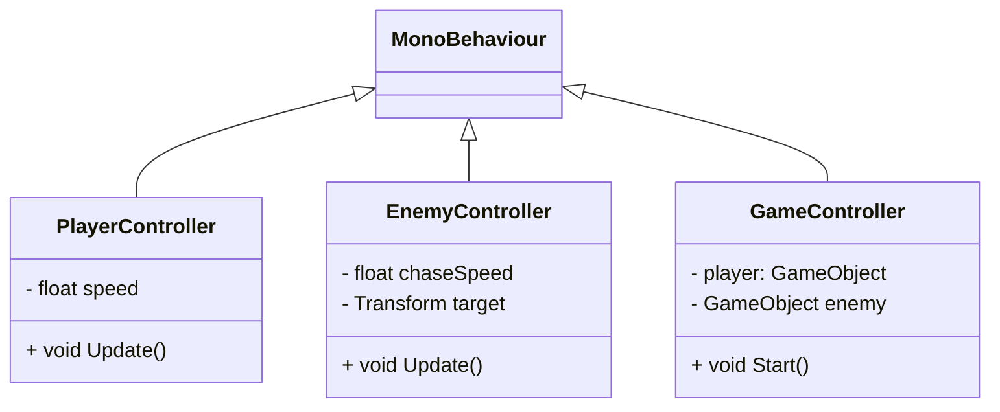

# 04-mermaid-sfuerst

```mermaid
  classDiagram
    MonoBehaviour <|-- PlayerController
    MonoBehaviour <|-- EnemyController
    MonoBehaviour <|-- GameController
    class GameController {
        - player: GameObject
        - GameObject enemy
        + void Start()
    }
    class PlayerController {
        - float speed
        + void Update()
    }
    class EnemyController {
        - float chaseSpeed
        - Transform target
        + void Update()
    }
```
